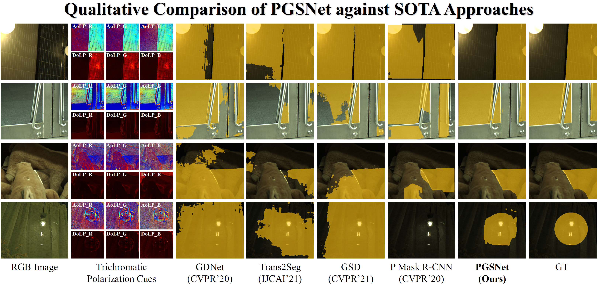
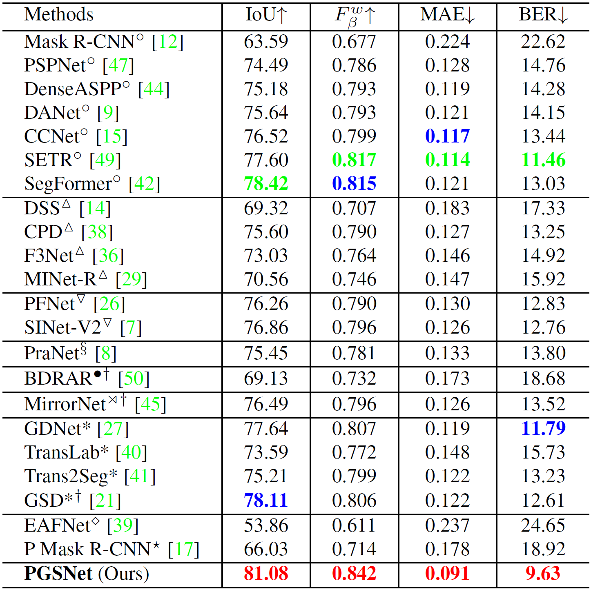
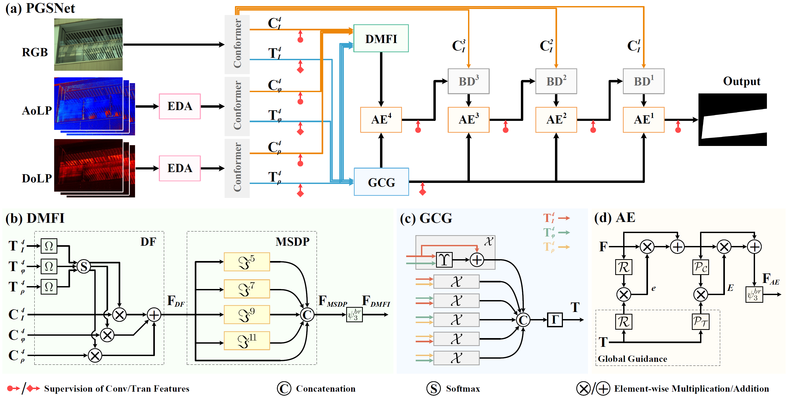

# CVPR2022_PGSNet

## Glass Segmentation using Intensity and Spectral Polarization Cues
[Haiyang Mei](https://mhaiyang.github.io/), [Bo Dong](https://dongshuhao.github.io/), Wen Dong, Jiaxi Yang, Seung-Hwan Baek, [Felix Heide](https://www.cs.princeton.edu/~fheide/), [Pieter Peers](http://www.cs.wm.edu/~ppeers/), Xiaopeng Wei, [Xin Yang](https://xinyangdut.github.io/)

[[Paper](https://openaccess.thecvf.com/content/CVPR2022/papers/Mei_Glass_Segmentation_Using_Intensity_and_Spectral_Polarization_Cues_CVPR_2022_paper.pdf)]&nbsp;&nbsp;[[Project Page](https://mhaiyang.github.io/CVPR2022_PGSNet/index.html)]

RGBP-Glass training set:&nbsp;[[Google Drive](https://drive.google.com/file/d/1L7M3DlSeIeFr7eqDFfp5X_9UH6Qr-tPB/view?usp=sharing)]&nbsp;&nbsp;[[Baidu Disk](https://pan.baidu.com/s/1OlBf27cSglvYZCSM2Jv00w), fetch code: rgbp]

RGBP-Glass testing set:&nbsp;&nbsp;[[Google Drive](https://drive.google.com/file/d/1RyIAPN9xZLe6GPeDmPrU2RJ9fbBroga8/view?usp=sharing)]&nbsp;&nbsp;[[Baidu Disk](https://pan.baidu.com/s/1OlBf27cSglvYZCSM2Jv00w), fetch code: rgbp]

- [Table of Contents](#glass-segmentation-using-intensity-and-spectral-polarization-cues)
  * [1. Abstract](#1-abstract)
  * [2. Requirements](#2-requirements)
  * [3. Experiments](#3-experiments)
    + [3.1. Test](#31-test)
  * [4. Results](#4-results)
    + [4.1. Qualitative Comparison](#41-qualitative-comparison)
    + [4.2. Quantitative Comparison](#42-quantitative-comparison)
    + [4.3. Results Download](#43-results-download)
  * [5. Proposed RGBP-Glass Dataset](#5-proposed-rgbp-glass-dataset)
    + [5.1. Overview](#51-overview)
    + [5.2. File Structure](#52-file-structure)
    + [5.3. Download](#53-download)
  * [6. Citation](#6-citation)
  * [7. LICENSE](#7-license)
  * [8. Contact](#8-contact)

### 1. Abstract

Transparent and semi-transparent materials pose significant challenges for existing scene understanding and segmentation algorithms due to their lack of RGB texture which impedes the extraction of meaningful features. In this work, we exploit that the light-matter interactions on glass materials provide unique intensity-polarization cues for each observed wavelength of light. We present a novel learning-based glass segmentation network that leverages both trichromatic (RGB) intensities as well as trichromatic linear polarization cues from a single photograph captured without making any assumption on the polarization state of the illumination. Our novel network architecture dynamically fuses and weights both the trichromatic color and polarization cues using a novel global-guidance and multi-scale self-attention module, and leverages global cross-domain contextual information to achieve robust segmentation.  We train and extensively validate our segmentation method on a new large-scale RGB-Polarization dataset (RGBP-Glass), and demonstrate that our method outperforms state-of-the-art segmentation approaches by a significant margin.


### 2. Requirements
* Python 3.8.10
* PyTorch == 1.10.0
* TorchVision == 0.11.0
* CUDA 11.4
* tqdm
* timm

Lower version should be fine but not fully tested :-)


### 3. Experiments

#### 3.1. Test
Download `Conformer_base_patch16.pth` at [here](https://drive.google.com/file/d/1UoOyGa-vQtGWLAl-VADJ1bedzMaAvc22/view?usp=sharing) and pre-trained model `PGSNet.pth` at [here](https://mhaiyang.github.io/CVPR2022_PGSNet/index.html), then run `infer.py`.


### 4. Results

#### 4.1. Qualitative Comparison

<p align="center">
     <br />
    <em> 
    Figure 1: Qualitative comparison results.
    </em>
</p>

#### 4.2. Quantitative Comparison

<p align="center">
     <br />
    <em> 
    Table 1: Quantitative comparison results.
    </em>
</p>

#### 4.3. Results Download 

1. Results of our PGSNet can be found in this [download link](https://mhaiyang.github.io/CVPR2022_PGSNet/index.html).

2. Performance of competing methods can be found in this [download link](https://mhaiyang.github.io/CVPR2022_PGSNet/index.html).


### 5. Proposed RGBP-Glass Dataset

#### 5.1. Overview

<p align="center">
     <br />
    <em> 
    Overview of our RGBP-Glass dataset.
    </em>
</p>

#### 5.2. File Structure
	RGBP-Glass
	├── train
	│   ├── aolp
    │   |   ├── 20210717001004_aolp.tiff
    │   |   └── ...
	│   ├── dolp
    │   |   ├── 20210717001004_dolp.tiff
    │   |   └── ...
	│   ├── edge
    │   |   ├── 20210717001004_edge.png
    │   |   └── ...
	│   ├── image
    │   |   ├── 20210717001004_rgb.tiff
    │   |   └── ...
	│   ├── mask
    │   |   ├── 20210717001004_mask.png
    │   |   └── ...
	│   ├── reflection
    │   |   ├── 20210717001004_reflection.png
    │   |   └── ...
    │   └── instances_train.json
	├── test
	│   ├── aolp
    │   |   ├── 20210717001002_aolp.tiff
    │   |   └── ...
	│   ├── dolp
    │   |   ├── 20210717001002_dolp.tiff
    │   |   └── ...
	│   ├── image
    │   |   ├── 20210717001002_rgb.tiff
    │   |   └── ...
	│   ├── mask
    │   |   ├── 20210717001002_mask.png
    │   |   └── ...
    │   └── instances_test.json
	└── LICENSE

We also provide the reflection and edge maps of the training set, which are required for training some glass segmentation methods (our PGSNet is out of this case).

#### 5.3. Download

<p align="center">
     <br />
</p>


### 6. Citation
Please cite our paper if you find the work useful::

```
@InProceedings{Mei_2022_CVPR,
    author    = {Mei, Haiyang and Dong, Bo and Dong, Wen and Yang, Jiaxi and Baek, Seung-Hwan and Heide, Felix and Peers, Pieter and Wei, Xiaopeng and Yang, Xin},
    title     = {Glass Segmentation Using Intensity and Spectral Polarization Cues},
    booktitle = {Proceedings of the IEEE/CVF Conference on Computer Vision and Pattern Recognition (CVPR)},
    month     = {June},
    year      = {2022},
    pages     = {12622-12631}
}
```


### 7. License

Please see `LICENSE`

### 8. Contact
E-Mail: Haiyang Mei (haiyang.mei@outlook.com)


**[⬆ back to top](#1-abstract)**